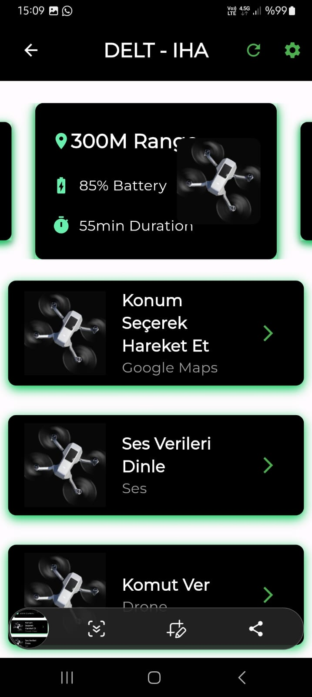
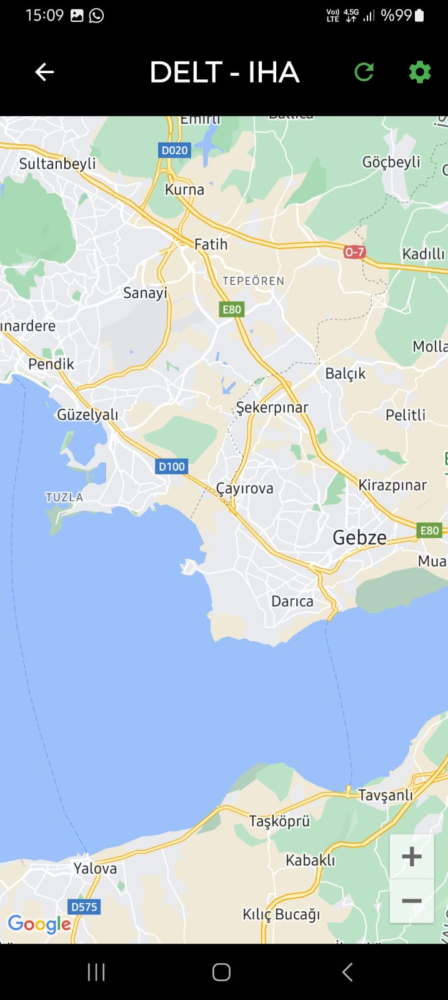
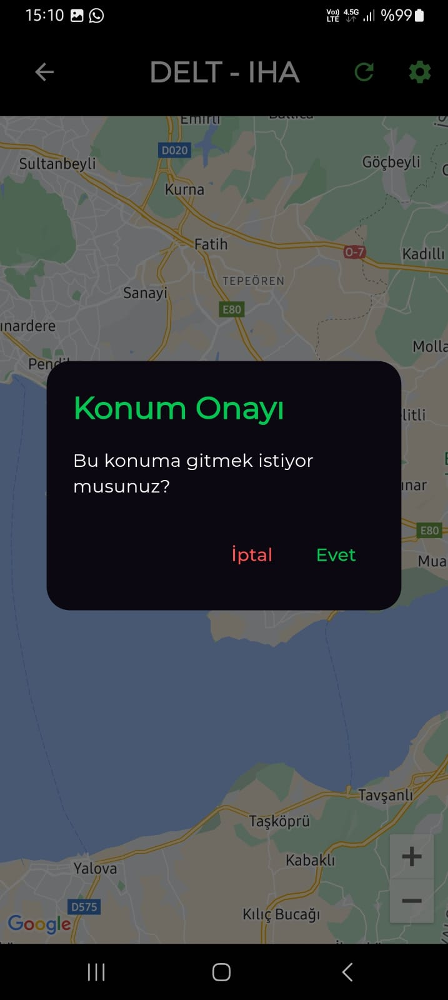
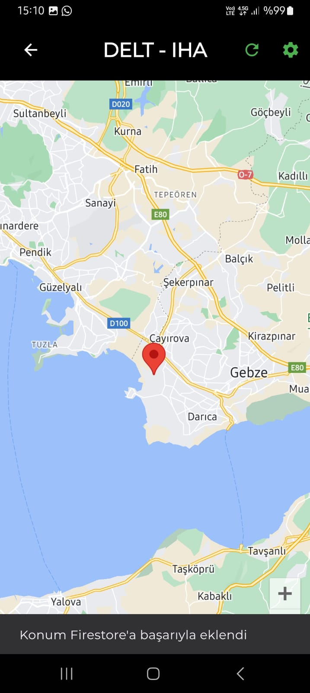
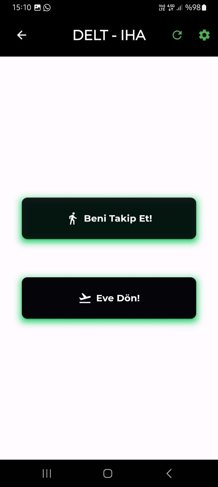
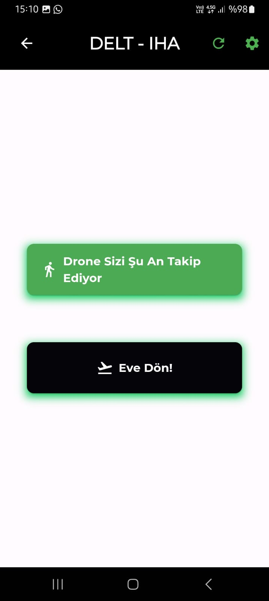
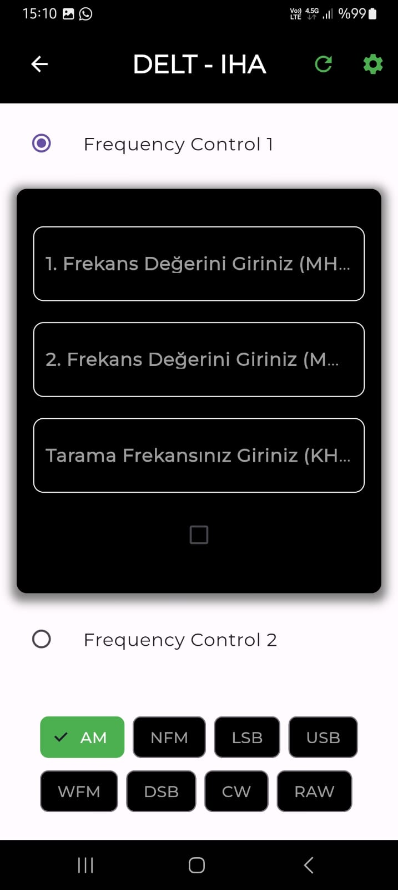
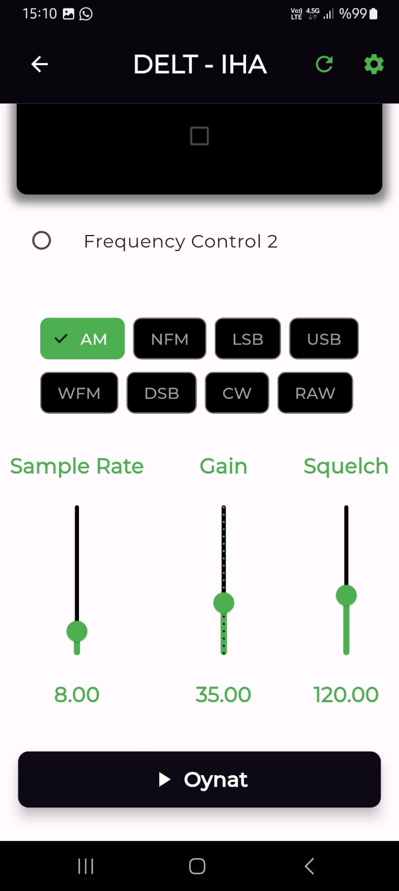
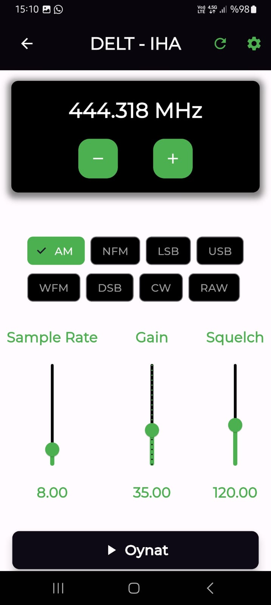

# teknofest-flutter
# DELT - IHA Uygulaması

DELT - IHA, bir drone kontrol ve izleme uygulamasıdır. Bu uygulama, kullanıcıların drone'larını çeşitli işlevler üzerinden kontrol etmelerine olanak tanır. Firebase ve Flutter kullanılarak geliştirilmiştir. Uygulama, drone'un konumunu izlemek, frekans ayarlamak ve diğer pek çok işlevi gerçekleştirebilir.
## Uygulama Ana Ekranı

## Özellikler

- **Gerçek Zamanlı Konum Takibi:** Drone'un anlık konumunu harita üzerinde gösterir.
- 
- 
- 
- **Frekans Kontrolü:** Drone'un iletişim frekansını ayarlama yeteneği.
- **Komut Verme:** Uzaktan drone'a komutlar gönderme.
- 
- 
- **Ses Dinleme:** Drone tarafından alınan ses verilerini dinleme.
- 
- 
- 
- **Durum İzleme:** Drone'un pil durumu, uçuş süresi gibi parametreleri izleme.

## Kullanılan Teknolojiler

- **Flutter:** Mobil uygulama geliştirme platformu.
- **Firebase:** Veritabanı yönetimi ve gerçek zamanlı veri senkronizasyonu.
- **Google Maps API:** Konum izleme ve görselleştirme.
